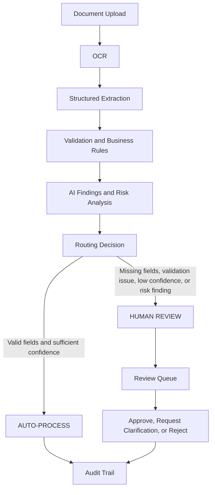
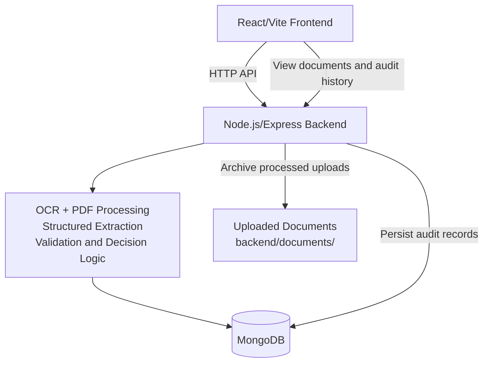

# IntelliFlow

## Overview

IntelliFlow is a document-processing and decision workflow prototype. It demonstrates how an uploaded document can move through OCR, structured field extraction, business-rule validation, risk and findings analysis, decision routing, human review, and persistent audit history.

The prototype is designed to make uncertain document processing visible and actionable. Documents that do not meet the required validation or confidence conditions are routed to `HUMAN REVIEW` instead of being treated as automatically approved.

## Problem

Document-based workflows often require people to inspect unstructured files, identify important fields, validate those fields against business rules, and decide whether a document can proceed. OCR and extraction can be affected by scan quality, complex layouts, ambiguous text, missing information, and distracting content.

IntelliFlow demonstrates a workflow that combines automated processing with a human-in-the-loop decision path. It provides structured results and processing history so that an operator can inspect the reasoning behind a routing decision.

## Prototype Workflow



The automated path runs OCR, extraction, validation, findings analysis, and routing. The human-in-the-loop path begins when the prototype identifies information that requires verification; a reviewer can then take an action from the Review Queue. Both paths contribute to the processing history.

## Key Capabilities

- Upload PDF, PNG, JPG, and JPEG documents.
- Render multi-page PDFs for OCR processing.
- Extract structured fields from OCR text, including:
  - Application ID
  - Customer Name
  - Loan Amount
  - Date
  - PAN
- Preserve additional recognized labeled fields when available, such as address, employer, employment type, monthly income, phone, and email.
- Validate required fields and display validation results.
- Calculate a processing confidence value.
- Generate AI/document findings and risk information shown in the Decision Center.
- Route documents to `AUTO-PROCESS` or `HUMAN REVIEW`.
- Review human-review items through Approve, Request Clarification, Reject, and Open Analysis actions.
- View extracted data, validation results, confidence, findings, routing decision, and processing trace in the Decision Center.
- Maintain persistent processing and audit history in MongoDB.

## Architecture



The frontend and backend run as separate local processes. The backend accepts uploads, processes documents, archives processed files in `backend/documents/`, and stores processing records in MongoDB.

## Technology Stack

| Area | Technology |
| --- | --- |
| Frontend | React 19, Vite |
| Backend | Node.js, Express |
| Database | MongoDB via Mongoose |
| OCR | Tesseract.js |
| PDF processing | PDF.js with `@napi-rs/canvas` |
| Upload handling | Multer |

## Project Structure

```text
.
├── backend/
│   ├── db.js
│   ├── package.json
│   ├── processor.js
│   ├── server.js
│   ├── models/
│   │   └── Audit.js
│   ├── documents/
│   └── uploads/
├── frontend/
│   ├── package.json
│   └── src/
│       ├── App.jsx
│       ├── App.css
│       ├── index.css
│       └── main.jsx
├── .gitignore
└── README.md
```

Runtime upload and document-storage directories are ignored by Git. Their contents may vary between local runs.

## Prerequisites

- Node.js and npm
- MongoDB running locally

The backend connects to the local MongoDB instance at `mongodb://127.0.0.1:27017/intelliflow`.

## Installation

Install backend dependencies:

```bash
cd backend
npm install
```

Install frontend dependencies:

```bash
cd frontend
npm install
```

## Running IntelliFlow

MongoDB must already be running. Start the backend and frontend in two separate terminals.

**Terminal 1: backend**

```bash
cd backend
node server.js
```

**Terminal 2: frontend**

```bash
cd frontend
npm run dev
```

The application is then available at:

- Frontend: http://localhost:5173
- Backend: http://localhost:5000

## Demo Walkthrough

1. Start MongoDB locally.
2. Start the backend with `node server.js`.
3. Start the frontend with `npm run dev`.
4. Upload a test document through the application.
5. Inspect the OCR output and structured extraction.
6. Review the field validation results.
7. Review the AI findings and risk information.
8. Inspect the routing decision and confidence.
9. If `HUMAN REVIEW` is generated, open the Review Queue.
10. Demonstrate one available human action, such as Approve, Request Clarification, or Reject.
11. Open the Audit Trail and inspect the persistent processing history.

Complex multi-page PDFs can be used to demonstrate how distractor amounts, multiple dates, renewal clauses, missing or pending attachments, payment terms, and incomplete or OCR-ambiguous fields affect extraction and routing. No particular test document is assumed to be included in the repository.

## Human-in-the-Loop

`HUMAN REVIEW` exists because automated document processing should not silently treat uncertain information as a successful decision. The prototype can route a document for human verification when it detects:

- Missing mandatory fields
- Validation failures
- Low confidence or ambiguous extraction
- Document risk findings

This keeps uncertain extraction in an explicit review path. Reviewers can use the Review Queue to Approve, Request Clarification, Reject, or Open Analysis.

## Audit Trail

The Audit Trail stores persistent processing history in MongoDB. The processing stages represented in the prototype include:

- Document uploaded
- OCR extraction completed
- Fields structured
- Validation rules executed
- Decision generated

The Decision Center also shows the processing trace alongside the routing decision, confidence, AI findings, extracted data, and validation results. This is prototype audit history, not immutable or compliance-grade audit logging.

## Prototype Notes / Limitations

- OCR quality depends on the quality and layout of the uploaded document.
- Complex documents may contain OCR ambiguity or distracting content.
- Extracted values and confidence should be reviewed rather than assumed to be perfect.
- The prototype uses `HUMAN REVIEW` when automated extraction or validation is uncertain.
- IntelliFlow is a functional hackathon demonstration, not a production-ready document-processing system.
- No deployment instructions are provided because this prototype is intended to run locally.

## Hackathon Demonstration

IntelliFlow demonstrates an end-to-end document workflow that combines:

- Document processing and OCR
- Structured field extraction
- Business-rule validation
- Risk and findings analysis
- Decision routing
- Human-in-the-loop review
- Persistent audit history

The prototype focuses on making the boundary between automated processing and human decision-making clear and inspectable.
