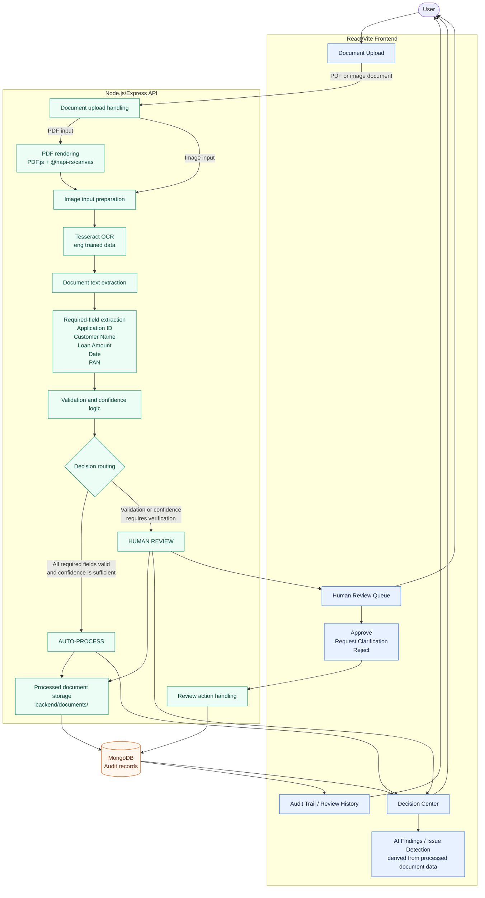

# IntelliFlow Architecture

This diagram represents the current local IntelliFlow prototype. The backend performs document processing and routing, while the React frontend presents the Decision Center, derives the displayed AI findings from processed document data, and provides the human review actions.

## Flow Notes

- PDF files are rendered into page images before OCR; image uploads go directly through the image-processing path.
- Tesseract OCR produces document text, which the backend uses for required-field extraction and validation.
- Routing produces either `AUTO-PROCESS` or `HUMAN REVIEW`. The latter is used when required fields, validation, or confidence need human verification.
- AI findings and issue detection are displayed in the frontend from the processed document data; the prototype does not call an external AI service.
- Review Queue actions update the stored audit record, and the Audit Trail displays the persistent processing and review history from MongoDB.
