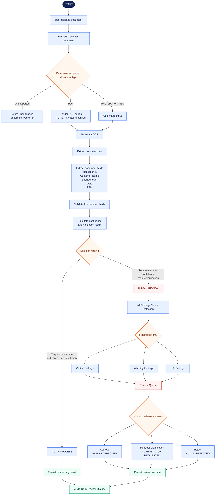

# IntelliFlow End-to-End Workflow

This flowchart represents the current IntelliFlow document-processing prototype, from upload through automated routing or human review and audit history.

## Implementation Notes

- Supported uploads are PDF, PNG, JPG, and JPEG files.
- PDF inputs are rendered page by page before being sent to Tesseract OCR. Image inputs proceed directly to OCR.
- The backend extracts and validates Application ID, Customer Name, Loan Amount, Date, and PAN, then calculates confidence and produces either `AUTO-PROCESS` or `HUMAN REVIEW`.
- AI findings are derived from the processed document data in the frontend and are grouped as Critical, Warnings, or Info. They are displayed as document risk analysis; no external AI service is represented here.
- Human review actions update the stored decision as `HUMAN-APPROVED`, `CLARIFICATION REQUESTED`, or `HUMAN-REJECTED`.
- Processing results and review outcomes are persisted in MongoDB and shown through the Audit Trail / Review History.
